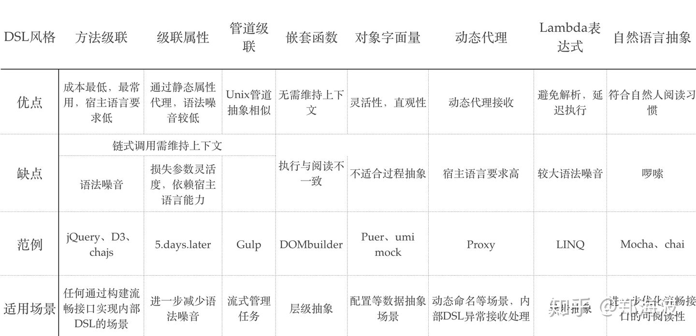

[toc]
# 概念
- DSL领域特定语言（Domain Specific Language）
- GPL通用编程语言（General Purpose Language）
# 分类
## 外部 DSL
它是一种独立的编程语言，需要从解析器开始实现自己的编译工具，实现成本较高。但它的语法的灵活性更高，更容易达到用户的表现力需求。

- 例子
  - GPPL「General Purpose Programming Language」，通用编程语言
  - mustache
  - HTML、CSS、LESS、JSX
  - JSX
  - 2 weeks ago
## 内部 DSL(Embedded DSL or Internal DSL)
它是建立在其它宿主语言之上（一般为 GPPL）的特殊 DSL，它与宿主语言共享编译与调试工具等基础设施，学习成本更低，也更容易被集成。他在语法上与宿主语言同源，但在运行时上需要做额外的封装。
- 例子
  - JQuery
  - Grunt、Glup、Mocha
  - (2).weeks().ago()
- 风格
  - 级联方法
    - jQuery的链式调用
  - 级联管道，级联管道只是一种级联方法的特殊应用
    - gulp
      - gulp 是一种类似 make 构建任务管理工具，它将文件抽象为一种叫 Vinyl(Virtual file format) 的类型，抽象文件使用 pipe 方法依次通过 transformer 从而完成任务。
      ```js
      gulp.src('./scss/**/*.scss')
        .pipe(plumber())
        .pipe(sass())
        .pipe(rename({ suffix: '.min' }))
        .pipe(postcss())
        .pipe(dest('./css')
      ```
  - 级联属性
    - 例子
      - (2).weeks.ago
        - 比(2).weeks().ago()优雅
      ```
      const hours = 1000 * 60 * 60;
      const days = hours * 24;
      const weeks = days * 7;
      const UNIT_TO_NUM = { hours, days, weeks };

      class Duration {
        constructor(num, unit) {
          this.number = num;
          this.unit = unit;
        }
        toNumber() {
          return UNIT_TO_NUM[this.unit] * this.number;
        }
        get ago() {
          return new Date(Date.now() - this.toNumber());
        }
        get later() {
          return new Date(Date.now() + this.toNumber());
        }
      }
      Object.keys(UNIT_TO_NUM).forEach(unit => {
        Object.defineProperty(Number.prototype, unit, {
          get() {
            return new Duration(this, unit);
          }
        });
      });
      ```
  - 嵌套函数
    - 天然不适合流程、时间等顺序敏感的场景
    - 执行逻辑与阅读顺序显然不一致，并且会加重书写负担(同时要关心开闭逻辑)，极大影响读写流畅度。
    - 例子
      ```
      with(DOMBuilder.dom) {
        const node =
          div('#container',
            h1('This is hyperscript'),
            ul({title},
              li(
                  a({herf:'abc.com'}, 'One list item')
              ),
              li('Another list item')
          )
      }
      ```
  - 对象字面量
    - 对象字面量的结构性较强，一般只用来做配置等数据抽象的场景，不适合用在过程抽象的场景
    - 外部DSL（JSON/YAML）
    - 例子
      ```
      module.exports = {
        'GET /homepage': './view/static.html',
        'GET /blog': {
          title: 'Hello'
        },
        'GET /user/:id': (req, res)=>{
          res.render('user.vm')
        }
      }
      ```
  - 动态代理
    - 利用Proxy提供的元编程能力，动态命名方法（或元方法）
    - 例子
      ```
      function tag(tagName){
          return {tag: tagName}
      }

      const builder = new Proxy(tag, {
        get (target, property) {
          return tag.bind(null, property)
        }
      })

      builder.h1() // {tag: 'h1'}
      builder.tag_not_defined()  // {tag: 'tag_not_defined'}
      ```
  - Lambda 表达式
    - Lambda 表达式本质上是一种直观易读且延迟执行的逻辑表达能力，从而避免额外的解析工作
    - 例子
      ```
      const users = User.select('name')
        .where(user => user.id === 1);
        .where(user => user.age > 20);
        .sortBy('create_time')
      ```
  - 自然语言抽象
    - 以更贴近自然语言的方式去设计 DSL 的语法
    - 例子
      单元测试chai
      ```
      foo.should.be.a('number');
      tea.should.have.property('flavors').with.lengthOf(3);
      ```
- 小结
  - 
  - 无论是级联方法、级联管道还是级联属性，本质都是链式调用风格，链式调用的核心是上下文传递，所以每一次调用的返回实体是否符合用户的心智是 DSL 设计是否成功的重要依据。
  - 库设计就是语言设计 -----《代码的未来》松本行弘

## 语言工作台（Language Workbench）
（Language Workbench）是一种专用的 IDE，可以将 DSL 可视化，并且可以定义和构建一个 DSL。前端工程对于 IDE 和可视化的追求可以说一直是火热，VS code、各种前端搭建可视化工具。